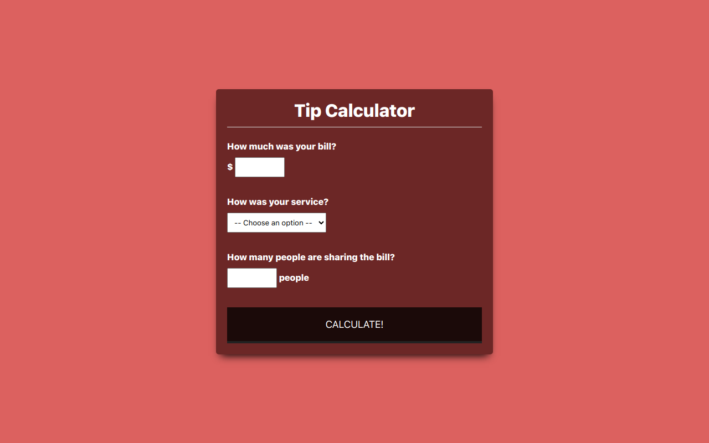

# Tip Calculator Web App

## Overview

Welcome to the Tip Calculator project! This application is designed to calculate tips quickly and efficiently, making it easy for users to determine the appropriate tip amount based on their total bill. Built with HTML, CSS, and JavaScript, this project showcases the power of DOM manipulation.

### Table of Contents

- [Installation](#installation)
- [Usage](#usage)
- [Technologies Used](#technologies-used)
- [Features](#features)
- [Project Structure](#project-structure)
- [Credits](#credits)
- [License](#license)



## Installation

To run this project locally, follow these steps:

1. Clone the repository to your local machine.
    ```bash
    git clone https://github.com/ramzancodeclub/Tip-Calculator.git
    ```

2. Open the project folder in your code editor.

3. Open the `index.html` file in your web browser.

## Usage

To use the tip calculator:

1. Open the [live demo](https://tip-calculator-liard-one.vercel.app/) or run it locally.

2. Enter the total bill amount.

3. Adjust the tip percentage using the provided drop down menu.

4. Optionally, specify the number of people to split the bill.

5. Instantly see the calculated tip and total amount per person.

## Technologies Used

- HTML
- CSS
- JavaScript (DOM manipulation)

## Features

- **User-Friendly Interface:** Simple and intuitive design for easy usage.

- **Tip Calculation:** Calculate tips based on a specified percentage of the total bill.

- **Split Bill Option:** Optionally split the total bill among a specified number of people.

- **Responsive:** Responsive design for various screen sizes.

## Project Structure

The project is structured for easy navigation, featuring a clean and responsive design.

## Credits

- [Muhammad Ramzan](https://github.com/ramzancodeclub) - Project Creator

## License

This project is licensed under the [MIT License](LICENSE). Feel free to use and modify the code as per the license terms.

## Badges


## How to Contribute

If you'd like to contribute to the project, follow these steps:

1. Fork the project.
2. Create a new branch for your feature: `git checkout -b feature-name`.
3. Commit your changes: `git commit -m 'Add new feature'`.
4. Push to the branch: `git push origin feature-name`.
5. Open a pull request.

## Contact

If you have any questions, suggestions, or just want to connect, feel free to reach out:

- Email: [ramzancodeclub@gmail.com](ramzancodeclub@gmail.com)
- Portfolio: [muhammad-ramzan.vercel.app](https://muhammad-ramzan.vercel.app/)
- LinkedIn: [in/ramzancodeclub](https://www.linkedin.com/in/ramzancodeclub/)

## Tests

The project includes a set of tests to ensure the functionality is working as expected. To run the tests, use the following command:
```bash
npm test
```

Happy tipping!
